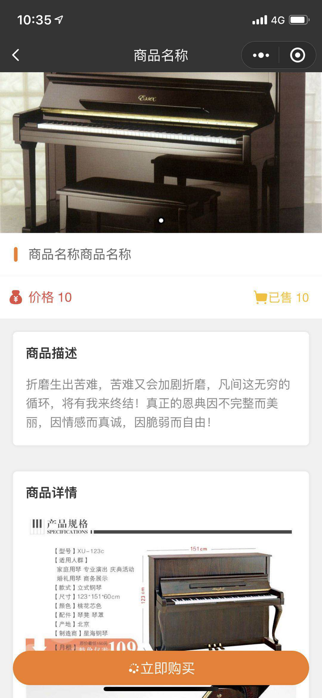

# wechat-miniProgram
> ##### record some methods
**目录**

|功能名称          |功能描述        |上传时间        |
| :-------------|:-------------|:-------------:|
|[1.自定义沉浸式头部导航组件设计](#1-自定义沉浸式头部导航组件设计)|自带返回，任意更改系统状态栏颜色的|2019-04-13|
|[2.全局按钮点击手机震动反馈](#2-全局按钮点击手机震动反馈)|自带返回，任意更改系统状态栏颜色的|2019-04-13|

###### 1 自定义沉浸式头部导航组件设计

* 创建名为header的 `.wxml` `.json` `.wxss` `.js` 文件;
* 

###### 2 全局按钮点击手机震动反馈